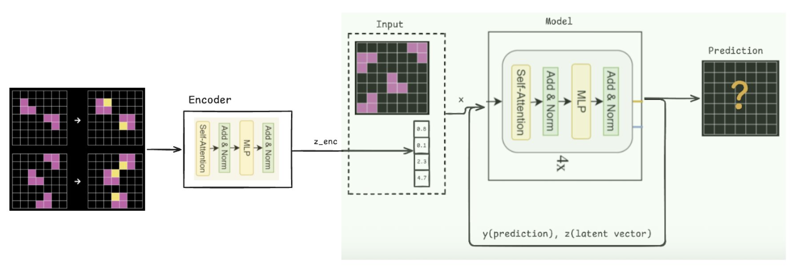

# 3. Method

## 3.1 Overview: From Memorization to Generalization

The Tiny Recursive Model (TRM) [@trm] achieves strong performance on ARC-AGI through recursive reasoning with deep supervision. However, TRM relies on a learned embedding matrix that maps puzzle identifiers to task-specific representations. Critically, this embedding matrix includes entries for *both* training and evaluation puzzles—their embeddings receive gradient updates during training even though their test queries are held out. This design choice means TRM cannot solve puzzles without corresponding embeddings, fundamentally limiting it to interpolation rather than true generalization.

We propose **Encoder-based TRM (ETRM)**, which replaces the embedding lookup with a neural encoder that computes task representations from demonstration input-output pairs at inference time. This simple modification transforms TRM from a memorization-based system into one capable of true few-shot learning:

$$
\begin{aligned}
\text{TRM:} \quad & \mathbf{c} = \text{EmbeddingMatrix}[\text{puzzle\_id}] \\
\text{ETRM:} \quad & \mathbf{c} = \text{Encoder}(\{(\mathbf{x}_i^{\text{in}}, \mathbf{x}_i^{\text{out}})\}_{i=1}^K)
\end{aligned}
$$

where $\mathbf{c} \in \mathbb{R}^{T \times D}$ is the task context ($T=16$ tokens, $D=512$ dimensions), and $K$ is the number of demonstration input-output pairs. The encoder learns to extract transformation rules from demonstrations, enabling generalization to any puzzle—including those never seen during training.

Our key design principle is to preserve TRM's decoder architecture unchanged [@trm]. The recursive reasoning mechanism and deep supervision that make TRM effective are retained; we only modify how task context is obtained.

## 3.2 Background: TRM Architecture

Before describing our encoder designs, we briefly review TRM's architecture and its fundamental limitation.

### 3.2.1 Task Context via Puzzle Embedding Lookup

TRM obtains task context through a learned embedding matrix indexed by puzzle identifier:

```
# TRM: Task context from embedding lookup
def trm_get_context(puzzle_id):
    # puzzle_emb: learned matrix of shape (num_puzzles, T, D)
    # Includes entries for ALL puzzles (training AND evaluation)
    return puzzle_emb[puzzle_id]  # Returns (T, D) context
```


**Figure 2: TRM Architecture.** Task context is obtained via embedding matrix lookup indexed by puzzle ID. The embedding matrix includes entries for both training and evaluation puzzles, limiting the model to interpolation rather than true generalization.

**Critical limitation**: The embedding matrix must contain an entry for every puzzle the model will encounter. Since evaluation puzzle IDs are included in the matrix and receive gradient updates during training, TRM cannot generalize to truly unseen puzzles—it can only interpolate among puzzles in its embedding matrix.

### 3.2.2 Dual-State Recursive Reasoning

Given the task context, TRM maintains two latent states that are iteratively refined:
- $\mathbf{y}$: The current predicted solution (embedded)
- $\mathbf{z}$: A latent reasoning state

```
def trm_forward(x, puzzle_id, y, z, H_cycles=3, L_cycles=6):
    # Get task context via embedding lookup (not from demos!)
    c = puzzle_emb[puzzle_id]         # <-- The limitation

    input_emb = embed(x) + c          # Add task context to input

    for h in range(H_cycles):
        for l in range(L_cycles):
            z = f_θ(z, y + input_emb)  # Refine reasoning
        y = f_θ(y, z)                   # Update solution

    return y, z
```

The network $f_\theta$ is a small 2-layer transformer [@transformer]. Despite its simplicity, the recursive application creates an effective depth of $H \times (L+1) \times 2 = 42$ layers.

### 3.2.3 Deep Supervision with Adaptive Computation

TRM uses deep supervision: the carry state $(\mathbf{y}, \mathbf{z})$ persists across training steps, with each step providing supervision. A Q-head learns when to halt, implementing Adaptive Computation Time (ACT) [@act]. During training, an exploration probability $p_{\text{explore}}$ encourages the model to sometimes continue beyond the Q-head's recommendation.

## 3.3 Encoder Architectures

We explore three paradigms for the demonstration encoder, each embodying a different hypothesis about what makes an effective task representation.



**Figure 3: ETRM Architecture.** Task context is computed from demonstration input-output pairs via a neural encoder, replacing the embedding matrix lookup. This enables generalization to novel tasks never seen during training.

### 3.3.1 Feedforward Deterministic Encoder

**Hypothesis**: A fixed forward pass through the encoder can extract sufficient information from demonstrations to characterize the transformation rule.

The encoder operates in two stages:

**Stage 1: Per-Demo Grid Encoding.** Each demonstration pair $(\mathbf{x}_i^{\text{in}}, \mathbf{x}_i^{\text{out}})$ is encoded independently. We concatenate the input and output grids and process them with a transformer [@transformer]:

$$
\mathbf{h}_i = \text{TransformerEnc}([\mathbf{x}_i^{\text{in}}; \mathbf{x}_i^{\text{out}}]) \in \mathbb{R}^{2S \times D}
$$

where $S = 900$ is the sequence length (flattened 30×30 grid). The transformer uses $N$ self-attention layers with rotary position embeddings. We then pool to a single vector:

$$
\mathbf{e}_i = \text{MeanPool}(\mathbf{h}_i \odot \mathbf{m}_i) \in \mathbb{R}^D
$$

where $\mathbf{m}_i$ masks padding tokens.

**Stage 2: Set Aggregation via Cross-Attention.** To aggregate the $K$ demo encodings $\{\mathbf{e}_i\}_{i=1}^K$ into the final context, we use cross-attention with learnable query tokens [@set-transformer]:

$$
\mathbf{c} = \text{CrossAttn}(\mathbf{Q}, \mathbf{E}, \mathbf{E}) \in \mathbb{R}^{T \times D}
$$

where $\mathbf{Q} \in \mathbb{R}^{T \times D}$ are $T=16$ learnable query tokens and $\mathbf{E} = [\mathbf{e}_1; \ldots; \mathbf{e}_K] \in \mathbb{R}^{K \times D}$ are the stacked demo encodings. This allows each output token to selectively attend to relevant demonstrations, potentially capturing different aspects of the transformation rule.

The complete feedforward deterministic encoder is:

```
def deterministic_encoder(demo_inputs, demo_outputs, demo_mask):
    # Stage 1: Encode each demo pair
    B, K, S = demo_inputs.shape
    encodings = []
    for i in range(K):
        h = transformer_enc(concat(demo_inputs[:,i], demo_outputs[:,i]))
        e = mean_pool(h, mask=demo_mask[:,i])
        encodings.append(e)
    E = stack(encodings, dim=1)  # (B, K, D)

    # Stage 2: Cross-attention aggregation
    Q = learnable_queries.expand(B, -1, -1)  # (B, T, D)
    context = cross_attention(Q, E, E, mask=demo_mask)
    return context  # (B, T, D)
```

### 3.3.2 Feedforward Variational Encoder

**Hypothesis**: A variational bottleneck encourages learning a structured, smooth latent space of transformation rules, improving generalization to novel puzzles.

We explore two variational architectures:

**Cross-Attention VAE.** This variant applies the variational bottleneck *after* aggregating information from all demonstrations:

1. Encode each demo with a deep transformer (8 layers)
2. Aggregate via cross-attention (same as deterministic)
3. Pool the context and project to variational parameters:
   $$
   \boldsymbol{\mu}, \log \boldsymbol{\sigma}^2 = \text{MLP}(\text{MeanPool}(\mathbf{c}))
   $$
4. Sample via reparameterization [@vae]:
   $$
   \mathbf{z} = \boldsymbol{\mu} + \boldsymbol{\sigma} \odot \boldsymbol{\epsilon}, \quad \boldsymbol{\epsilon} \sim \mathcal{N}(\mathbf{0}, \mathbf{I})
   $$
5. Decode back to context shape:
   $$
   \mathbf{c} = \text{Reshape}(\text{Linear}(\mathbf{z})) \in \mathbb{R}^{T \times D}
   $$

The KL divergence [@vae] regularizes toward a standard normal prior:
$$
\mathcal{L}_{\text{KL}} = D_{\text{KL}}(q(\mathbf{z}|\text{demos}) \| p(\mathbf{z})) = -\frac{1}{2}\sum_j \left(1 + \log \sigma_j^2 - \mu_j^2 - \sigma_j^2\right)
$$

**Per-Demo VAE.** Inspired by the Latent Program Network (LPN) architecture [@lpn], this variant applies variational inference to each demonstration independently before aggregation:

1. Encode each demo with a shallow transformer (2 layers, 128 hidden—matching LPN exactly)
2. Project each encoding to per-demo variational parameters:
   $$
   \boldsymbol{\mu}_i, \log \boldsymbol{\sigma}_i^2 = \text{Linear}(\mathbf{e}_i)
   $$
3. Sample each demo's latent [@vae]: $\mathbf{z}_i = \boldsymbol{\mu}_i + \boldsymbol{\sigma}_i \odot \boldsymbol{\epsilon}_i$
4. Aggregate via mean pooling (not cross-attention):
   $$
   \bar{\mathbf{z}} = \frac{1}{K}\sum_{i=1}^K \mathbf{z}_i
   $$
5. Project to context: $\mathbf{c} = \text{Reshape}(\text{Linear}(\bar{\mathbf{z}}))$

The KL loss [@vae] averages over valid demonstrations:
$$
\mathcal{L}_{\text{KL}} = \frac{1}{K}\sum_{i=1}^K D_{\text{KL}}(q(\mathbf{z}_i|\mathbf{x}_i, \mathbf{y}_i) \| p(\mathbf{z}))
$$

**Key Difference**: Cross-Attention VAE applies the bottleneck after seeing all demos together, potentially capturing cross-demo patterns. Per-Demo VAE treats each demo independently, relying on mean aggregation to combine information—simpler but potentially losing demo interactions.

**Note on LPN**: We adopt LPN's encoder architecture [@lpn] for comparison, but we do *not* use their gradient-based test-time search. Our encoders produce fixed representations without test-time optimization.

### 3.3.3 Iterative Encoder (Joint Encoder-Decoder Refinement)

**Hypothesis**: The same inductive bias that makes recursive refinement effective for the decoder might also benefit the encoder. Rather than computing task context once, we let the encoder refine its representation alongside the decoder's reasoning.

This architecture mirrors TRM's decoder structure within the encoder:

**Encoder State**: The encoder maintains dual latent states analogous to the decoder:
- $\mathbf{z}_e^H$: High-level context (serves as output to decoder)
- $\mathbf{z}_e^L$: Low-level reasoning state

**Hierarchical Refinement**: Each ACT [@act] step, the encoder refines its states using the same H/L loop pattern as the decoder:

```
def iterative_encoder_step(z_e_H, z_e_L, demo_input, H_cycles, L_cycles):
    # demo_input: aggregated demo representation

    for h in range(H_cycles):
        for l in range(L_cycles):
            z_e_L = L_level(z_e_L, z_e_H + demo_input)
        z_e_H = L_level(z_e_H, z_e_L)

    return z_e_H, z_e_L  # z_e_H is context for decoder
```

**Joint Evolution**: Unlike feedforward encoders that compute context once, the iterative encoder's carry state persists across ACT steps [@act]. The encoder refines its understanding of the transformation rule as the decoder refines its prediction—a form of joint reasoning.

**Rationale**: If recursive refinement helps the decoder progressively improve predictions, perhaps it can similarly help the encoder progressively clarify its understanding of the task. This is speculative—it's unclear whether encoding benefits from iteration the same way decoding does.

## 3.4 Integration with TRM Decoder

For all encoder types, integration with the TRM decoder follows a consistent pattern:

1. **Context Injection**: The encoder output $\mathbf{c} \in \mathbb{R}^{T \times D}$ replaces the puzzle embedding
2. **Position Concatenation**: Context is prepended to input token embeddings
3. **Forward Pass**: The combined representation flows through TRM's recursive reasoning

The decoder architecture remains unchanged from original TRM [@trm]:
- Same dual-state design ($\mathbf{y}$, $\mathbf{z}$)
- Same H/L cycle structure
- Same ACT [@act] halting mechanism
- Deep supervision at each step

## 3.5 Training Protocol

### 3.5.1 Strict Train/Evaluation Separation

A critical difference from TRM is our enforcement of complete data separation:

| Split | Puzzles | Purpose |
|-------|---------|---------|
| Training | ~560 groups (ARC-AGI training + concept) | Model training |
| Evaluation | ~400 groups (ARC-AGI evaluation) | Testing generalization |

**Key Property**: Evaluation puzzles' demonstrations are *never* seen during training. The encoder must extract transformation rules from demos it encounters for the first time at test time—true few-shot evaluation.

### 3.5.2 Data Augmentation

Following TRM, we apply approximately 1000 augmented versions per puzzle:

- **Color Permutation**: Random shuffle of colors 1-9 (black=0 remains fixed)
- **Dihedral Transforms**: 8 geometric transforms (4 rotations × 2 reflections)
- **Translation**: Random positioning within 30×30 grid (training only)

**Consistency Constraint**: The same augmentation is applied to all components of a puzzle (all demos + test input/output), preserving the transformation rule's structure.

### 3.5.3 Encoder Re-encoding: Solving Gradient Starvation

During development, we discovered a critical issue with caching encoder outputs.

**Problem**: Our initial implementation computed encoder output once when a sample started and cached it in the carry state. With dynamic halting, only samples that reset receive fresh encoder outputs—approximately 2% of samples per step. This meant the encoder received gradients from only 2% of the data, severely limiting its learning.

**Symptom**: Training accuracy plateaued at ~35% with minimal encoder learning.

**Solution**: Re-encode the full batch at every ACT step (no caching):

```
def forward_step(carry, batch):
    # ALWAYS encode - no caching
    context = encoder(batch['demo_inputs'],
                     batch['demo_outputs'],
                     batch['demo_mask'])

    # Proceed with decoder...
    output = decoder(carry, batch['inputs'], context)
    return output
```

This ensures 100% gradient coverage for the encoder, at the cost of additional computation. After this fix, training accuracy improved from 35% to over 86%.

### 3.5.4 Pretrained Decoder Initialization

We initialize the decoder from TRM's pretrained weights, which provides two benefits:

1. **Faster Convergence**: The decoder already knows recursive refinement for ARC-style tasks
2. **Encoder Focus**: The encoder can concentrate on learning good representations rather than jointly learning to decode

We explore two training modes:
- **Frozen Decoder**: Only encoder parameters updated (faster, ensures encoder learns)
- **Joint Fine-tuning**: Both encoder and decoder updated (potentially better final performance)

### 3.5.5 Variational Training

For VAE-based encoders, training includes the KL divergence term:

$$
\mathcal{L} = \mathcal{L}_{\text{CE}} + \beta \cdot \mathcal{L}_{\text{KL}}
$$

where $\mathcal{L}_{\text{CE}}$ is the cross-entropy reconstruction loss and $\beta$ weights the KL term.

**Practical Considerations**:
- **KL Annealing**: Start with $\beta=0$, gradually increase to target value
- **Numerical Stability**: Clamp $\log \sigma^2$ to $[-10, 10]$ to prevent overflow in $\exp$
- **Evaluation Mode**: Use mean ($\boldsymbol{\mu}$) without sampling for deterministic evaluation

## 3.6 Design Space Summary

**Table 3: Encoder architecture design space**

| Encoder Type | Aggregation | Variational | Parameters | Key Property |
|--------------|-------------|-------------|------------|--------------|
| Feedforward Deterministic | Cross-attention | No | ~15M | Simple, stable baseline |
| Cross-Attention VAE | Cross-attention | Post-aggregation | ~16M | Regularized latent space |
| Per-Demo VAE | Mean | Per-demo | ~1M | LPN-inspired, compact |
| Iterative (TRM-style) | Mean | No | ~8M | Joint refinement with decoder |

Each architecture embodies different hypotheses about task representation:
- **Cross-attention vs. Mean**: Can selective attention to specific demos improve representation?
- **Variational vs. Deterministic**: Does KL regularization improve generalization?
- **Iterative vs. Feedforward**: Does recursive refinement benefit encoding?

We evaluate these hypotheses empirically in Section 4.
