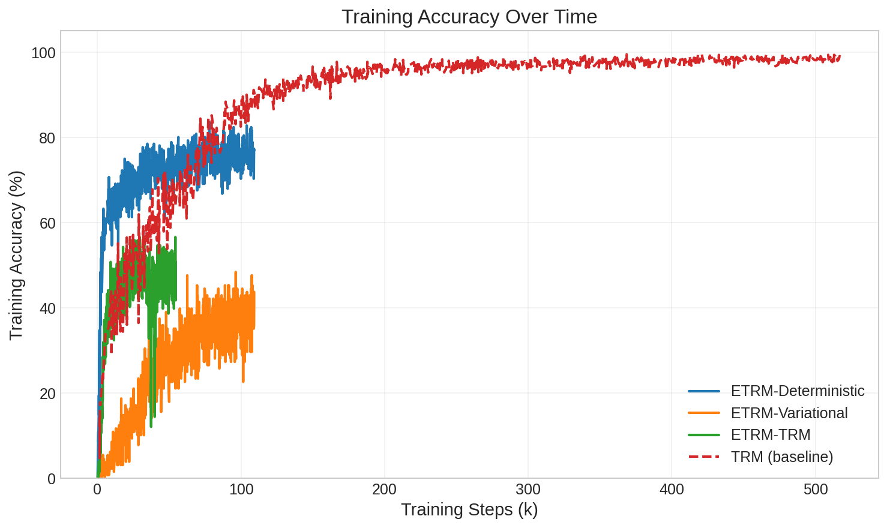
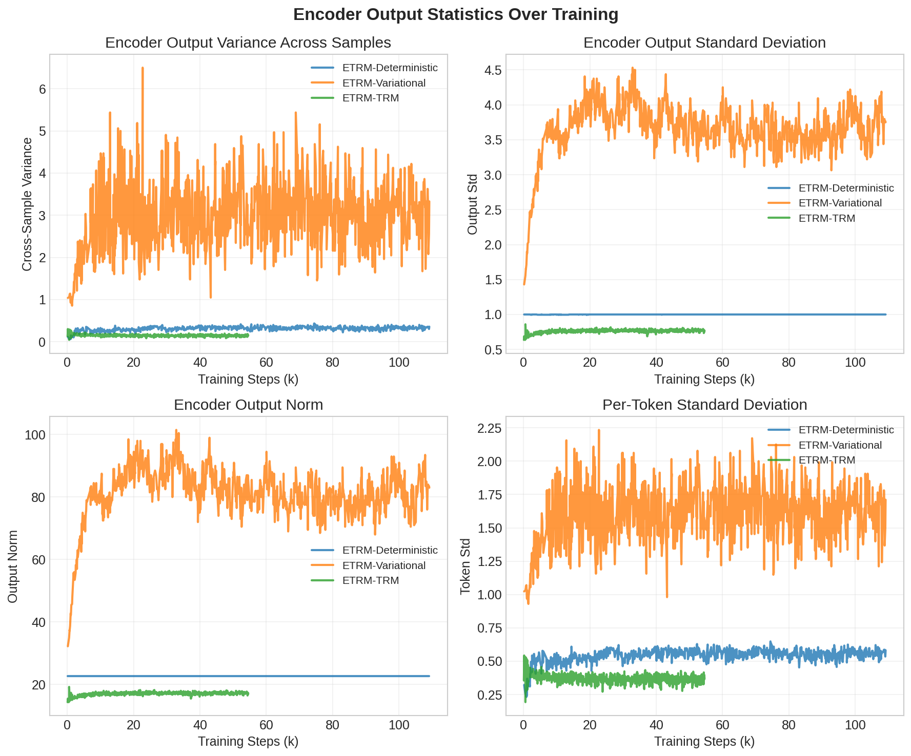
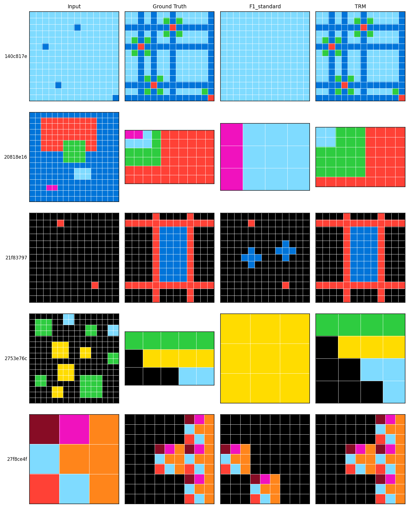

# 4. Experiments

We evaluate ETRM's ability to generalize to puzzles whose demonstrations were never seen during training. Our experiments reveal a striking negative result: all encoder architectures achieve 0% accuracy on held-out puzzles despite reasonable training performance, a phenomenon we attribute to encoder collapse.

## 4.1 Experimental Setup

### 4.1.1 Dataset

We train and evaluate on ARC-AGI-1, which contains 400 training puzzles and 400 evaluation puzzles [chollet2019]. Following TRM [trm], we augment the training set with approximately 160 additional "concept" puzzles that target specific transformation primitives.

**Data Augmentation.** Each puzzle is augmented approximately 1000 times using:
- Color permutation: Random shuffle of colors 1-9 (black remains fixed)
- Dihedral transforms: 8 geometric transformations (4 rotations and 2 reflections)
- Translation: Random positioning within the 30x30 grid (training only)

The same augmentation is applied consistently to all components of a puzzle (demonstrations and test queries), preserving the transformation rule's structure.

**Critical Distinction: True Few-Shot Evaluation.** A key difference between ETRM and TRM evaluation lies in data separation. In TRM, evaluation puzzle identifiers exist in the embedding matrix and receive gradient updates during training—the model has effectively "seen" these puzzles [hrm-analysis]. In ETRM, we enforce strict separation: evaluation puzzle demonstrations are *never* seen during training. The encoder must extract transformation rules from demonstrations it encounters for the first time at test time. This is true few-shot evaluation.

**Table 4: Dataset split summary**

| Split | Puzzle Groups | Augmentation Factor | Total Samples | Use |
|-------|--------------|---------------------|---------------|-----|
| Training | ~560 (training + concept) | ~1000x | ~560,000 | Model training |
| Evaluation | ~400 (evaluation) | ~1000x | ~400,000 | True few-shot testing |

### 4.1.2 Evaluation Protocol

**Metrics.** We report Pass@k accuracy, where a puzzle is considered solved if the correct answer appears among the top-k most common predictions. We report Pass@1 (primary metric), Pass@2, and Pass@5.

**Voting Mechanism.** Following TRM [trm], we aggregate predictions across all augmented versions of each puzzle (~1000 per puzzle). Each augmented version produces a prediction, which is inverse-transformed back to the original coordinate space. The final prediction is determined by majority voting across these predictions.

**Subset Evaluation.** Due to computational constraints, we evaluate on a subset of 32 puzzle groups, representing approximately 8% of the full evaluation set. Evaluating the full set requires approximately 24 hours per model, as voting aggregates predictions across ~1000 augmented versions of each puzzle. While subset evaluation limits statistical power, the results are sufficiently clear (0% vs 37%+ accuracy) that the subset provides reliable signal.

### 4.1.3 Training Configuration

**Decoder Initialization.** We initialize the decoder from pretrained TRM weights, providing the benefit of an already-capable recursive reasoning module. Critically, the decoder is *not* frozen—gradients flow through all decoder parameters during training. This ensures that any failure to generalize cannot be attributed to a frozen decoder that cannot adapt to encoder outputs.

**Hyperparameters.** We use batch size 256 for deterministic and iterative encoders, reduced to 128 for Cross-Attention VAE due to memory constraints. ACT maximum steps is set to 16 with exploration probability 0.5. Following Section 3.5.3, we re-encode the full batch at every ACT step to ensure adequate gradient flow to the encoder.

**Table 5: Training hyperparameters**

| Parameter | Deterministic | Variational | Iterative |
|-----------|--------------|-------------|-----------|
| Batch size | 256 | 128 | 256 |
| Learning rate | 1e-4 | 1e-4 | 1e-4 |
| ACT max steps | 16 | 16 | 16 |
| Exploration prob | 0.5 | 0.5 | 0.5 |
| Grad clip norm | 1.0 | 1.0 | 1.0 |
| Re-encode batch | Yes | Yes | Yes |
| Decoder frozen | No | No | No |

### 4.1.4 Computational Resources

All experiments were conducted on a server with 4 NVIDIA A100 80GB GPUs. Training used distributed data-parallel execution via PyTorch's torchrun across all 4 GPUs. Each ETRM variant required approximately 12-24 hours to reach 175k training steps. The TRM baseline required approximately 48 hours to reach convergence at 518k steps.

## 4.2 TRM Baseline

We first reproduce TRM training to establish a baseline for comparison. Results at two checkpoints:

**Table 6: TRM baseline results**

| Model | Params | Pass@1 | Pass@2 | Pass@5 | Train Acc | Steps |
|-------|--------|--------|--------|--------|-----------|-------|
| TRM (155k steps) | 7M | 37.38% | 41.25% | 47.12% | 92.50% | 155k |
| TRM (converged) | 7M | 41.75% | 48.75% | 52.25% | 98.44% | 518k |

At 155k steps—comparable to our ETRM training duration—TRM achieves 37.38% Pass@1 accuracy with 92.50% training accuracy. With continued training to 518k steps, performance improves to 41.75% Pass@1 and 98.44% training accuracy.

## 4.3 ETRM Results

We evaluate three encoder architectures from Section 3.3, each embodying a different hypothesis about effective task representation:

**Table 7: ETRM results**

| Model | Encoder Type | Params | Pass@1 | Pass@2 | Pass@5 | Train Acc | Steps |
|-------|--------------|--------|--------|--------|--------|-----------|-------|
| ETRM-Deterministic | Feedforward Deterministic (Section 3.3.1) | 22M | 0.00% | 0.50% | 0.50% | 78.91% | 175k |
| ETRM-Variational | Cross-Attention VAE (Section 3.3.2) | 23M | 0.00% | 0.00% | 0.00% | 40.62% | 174k |
| ETRM-Iterative | Iterative TRM-style (Section 3.3.3) | 15M | 0.00% | 0.25% | 0.25% | 51.17% | 87k |

**Complete Generalization Failure.** All three encoder architectures achieve 0% Pass@1 accuracy on held-out puzzles. This is despite achieving 40-79% training accuracy—the models learn to solve training puzzles but completely fail to generalize.

**Architecture-Agnostic Failure.** The failure is consistent across fundamentally different encoder designs: feedforward deterministic, variational with KL regularization, and iterative with joint refinement. This suggests the problem is fundamental to the encoder-based approach rather than a matter of architectural choice.

**Table 8: Summary comparison at comparable training time**

| Model | Approach | Params | Pass@1 | Pass@2 | Pass@5 | Train Acc |
|-------|----------|--------|--------|--------|--------|-----------|
| TRM (155k) | Embedding lookup | 7M | 37.38% | 41.25% | 47.12% | 92.50% |
| ETRM-Deterministic | Feedforward encoder | 22M | 0.00% | 0.50% | 0.50% | 78.91% |
| ETRM-Variational | VAE encoder | 23M | 0.00% | 0.00% | 0.00% | 40.62% |
| ETRM-Iterative | Recurrent encoder | 15M | 0.00% | 0.25% | 0.25% | 51.17% |

## 4.4 Analysis

### 4.4.1 Training Dynamics

**Figure 4: Training accuracy over time for TRM and ETRM variants.** TRM (dashed line) reaches 98% accuracy and continues improving. ETRM variants plateau at lower accuracies: Feedforward Deterministic (79%), Iterative (51%), Cross-Attention VAE (41%).

Figure 4 shows training accuracy over time. TRM (dashed line) reaches 98% accuracy and continues improving throughout training. In contrast, ETRM variants plateau at substantially lower accuracies: the Feedforward Deterministic encoder reaches 79%, the Iterative encoder plateaus around 51%, and the Cross-Attention VAE struggles to exceed 41%.

The training accuracy gap between TRM and ETRM-Deterministic (92% vs 79% at comparable steps) already indicates that the encoder-based approach faces optimization challenges. However, the more striking observation is the complete disconnect between training and test performance for ETRM—79% training accuracy translates to 0% test accuracy.

### 4.4.2 Encoder Collapse

To understand the 0% test accuracy, we analyze the encoder outputs directly. We measure cross-sample variance: how different are encoder outputs across different puzzles?

**Figure 5: Encoder output statistics.** Analysis of cross-sample variance, within-sample variance, and output distributions reveals encoder collapse across all variants.

**Table 9: Encoder collapse analysis**

| Model | Cross-Sample Variance | Interpretation |
|-------|----------------------|----------------|
| ETRM-Deterministic | 0.36 | Low—collapsed |
| ETRM-Variational | 3.33 | Higher—KL prevents full collapse |
| ETRM-Iterative | 0.15 | Very low—severely collapsed |

**Diagnosis: Encoder Collapse.** The encoders learn to produce near-constant outputs regardless of input demonstrations. Cross-sample variance measures how much encoder outputs vary across different puzzles—low variance indicates the encoder produces similar representations for different transformation rules.

The Feedforward Deterministic encoder shows cross-sample variance of only 0.36, indicating highly similar outputs across puzzles. The Iterative encoder is even more severely collapsed at 0.15. Interestingly, the Cross-Attention VAE shows higher variance (3.33), likely because the KL regularization toward a standard normal prior prevents complete collapse—yet this does not translate to better test accuracy.

**Mechanism.** With collapsed encoder outputs, the decoder receives essentially the same "task representation" for every puzzle. The decoder cannot distinguish between different transformation rules, explaining the complete failure on held-out puzzles. During training, the model achieves reasonable accuracy by memorizing input-output mappings for specific training examples rather than learning to extract and apply transformation rules.

### 4.4.3 Qualitative Examples

**Figure 6: Predictions on held-out puzzles.** ETRM produces structured outputs but applies incorrect transformations (left columns), while TRM produces correct predictions (right columns). This is consistent with encoder collapse preventing task-specific context from reaching the decoder.

Figure 6 shows qualitative predictions on held-out evaluation puzzles. ETRM produces structured outputs—not random noise—but applies incorrect transformations. For example, where the ground truth requires a rotation operation, ETRM might produce a color-filling pattern unrelated to the demonstrated rule. This is consistent with encoder collapse: the decoder has learned *some* transformation behavior, but without puzzle-specific context, it cannot select the correct transformation.

In contrast, TRM (which has embeddings for these puzzles) produces predictions that match or closely approximate the ground truth, demonstrating that the decoder architecture is capable of solving these puzzles given appropriate task context.

### 4.4.4 Key Findings

Our experiments reveal several important findings:

1. **Complete generalization failure.** All ETRM variants achieve 0% Pass@1 accuracy on held-out puzzles, despite training accuracies ranging from 41% to 79%. The encoder-based approach fails to enable true few-shot learning.

2. **Encoder collapse explains the failure.** Analysis of encoder outputs reveals that all encoders produce near-constant outputs regardless of input demonstrations. The encoders fail to extract puzzle-specific information, instead collapsing to a fixed representation.

3. **Architecture-agnostic failure.** Feedforward, variational, and iterative encoder architectures all fail similarly. This suggests the problem is fundamental to learning to encode transformation rules from demonstrations, not a matter of architectural choice.

4. **Training-test gap.** The Feedforward Deterministic encoder achieves 79% training accuracy but 0% test accuracy—a complete disconnect. The model memorizes training puzzle input-output mappings rather than learning generalizable rule extraction.

5. **Contrast with TRM.** TRM achieves 37% Pass@1 at comparable training steps by memorizing puzzle embeddings. While not true generalization, this demonstrates the decoder's capability when given appropriate task context—a capability the collapsed encoders fail to leverage.

**Implications.** Replacing learned embeddings with a demonstration encoder is a natural idea for enabling generalization, but our experiments reveal this is substantially harder than expected. The encoder consistently collapses to constant outputs rather than learning to extract transformation rules from demonstrations. Understanding and preventing this collapse is essential for progress on encoder-based approaches to few-shot program induction.
